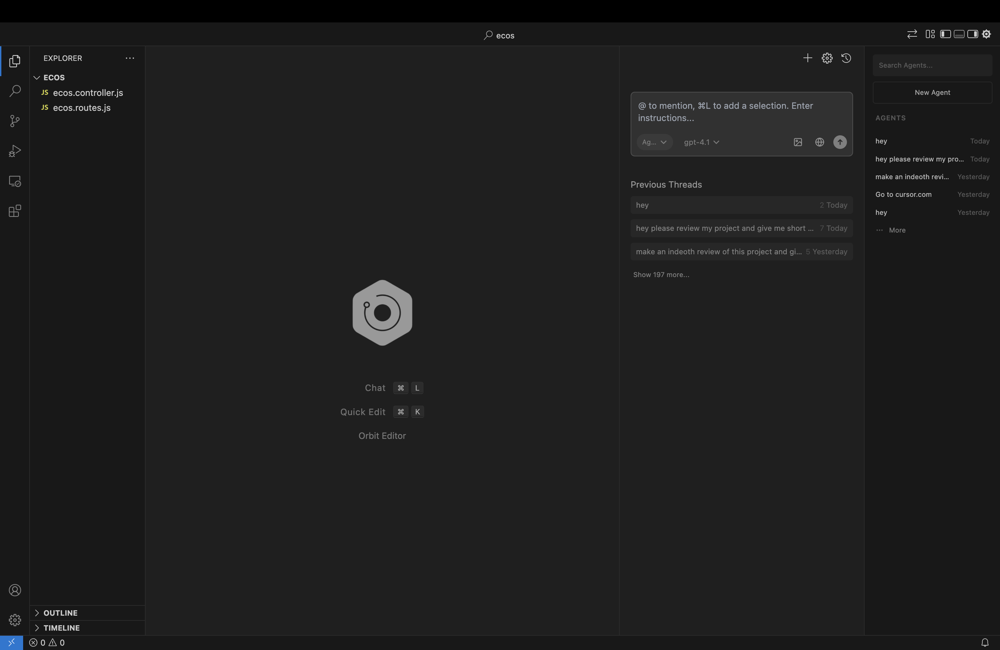

# Welcome to Orbit

	

Orbit is an open-source AI-powered code editor.

Use AI agents on your codebase, checkpoint and visualize changes, and bring any model or host locally. Orbit sends messages directly to providers without retaining your data.

This repository contains the full source code for Orbit.

## About

Orbit is a fork of [Void Editor](https://github.com/voideditor/void), which itself is a fork of [VS Code](https://github.com/microsoft/vscode). We are grateful to both projects for their excellent foundation.

## Links
- 🧭 [Website](https://vexelityai.com)
- 🧭 [GitHub Repository](https://github.com/ashish200729/orbiteditor)
- 👋 [Issues](https://github.com/ashish200729/orbiteditor/issues)
- 🚙 [Project Board](https://github.com/ashish200729/orbiteditor/projects)
- 💬 [Discord Community](https://discord.gg/ZPYkjPCDj8)

## Contributing

1. To get started working on Orbit, check out our Project Board! You can also see [HOW_TO_CONTRIBUTE.md](./HOW_TO_CONTRIBUTE.md).

2. Feel free to open issues and pull requests!

## License

Orbit's additions and modifications are licensed under the Apache License 2.0.

The VS Code base is licensed under the MIT License.

The Void Editor base contains both Apache 2.0 and MIT licensed components.

See [LICENSE.txt](./LICENSE.txt), [LICENSE-VS-Code.txt](./LICENSE-VS-Code.txt), and [NOTICE](./NOTICE) for full details.

## Support

You can reach us via [GitHub issues](https://github.com/ashish200729/orbiteditor/issues), join our [Discord server](https://discord.gg/ZPYkjPCDj8) for community support and discussions, or email us at [hello@vexelityai.com](mailto:hello@vexelityai.com).
